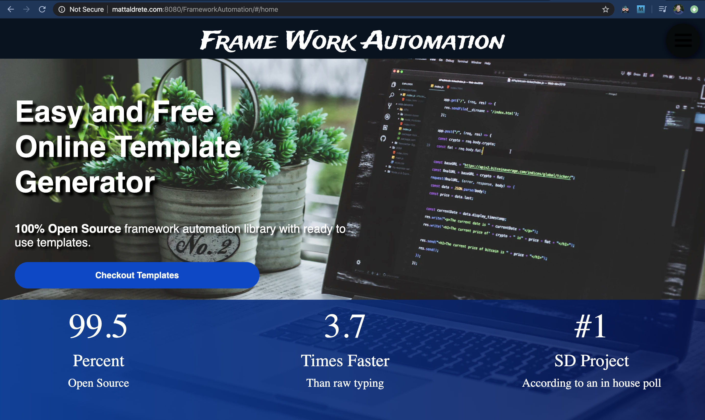
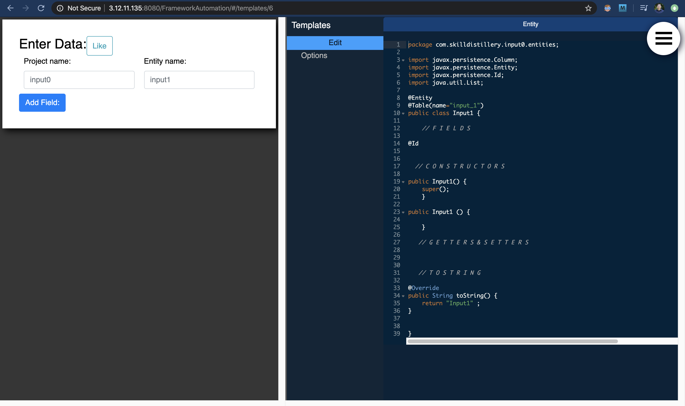

## Final Team Project for Skill Distillery 16-week Full Stack Boot Camp

## Framework Automation

### Home, Template Generator Page & Navigation bar

## Team
- Matt Aldrete -- Developer
- Luke Leonard -- DBA, Developer
- Marcus Wiseman -- Scrum Master, Developer
- Caleb Whitford -- Developer

## Overview
An  easy  to use, full stack, REST  based, web application allowing   programmers to write custom project templates which dynamically generate project wizards.

## How To Use
Select the Navigation dropdown menu and click search. Find the template you are looking for fill out form input fields and copy code  created in text editor and paste into your application for more help click on the template's instructions.

To Create a new template create an account by navigating to the register page through the dropdown navigation bar.

## Technologies Used
* Java,
* Angular
* REST API
* Spring Boot,
* Gradle
* JPA, SQL
* HTML, CSS, Javascript, Bootstrap
* Trello

## Difficulties Overcome
- Working with a teammate who was working remotely. We had to have work scheduled out so we could all be on the same page. We video conferenced every morning for our SCRUM meeting and relied on slack to communicate throughout the day.
